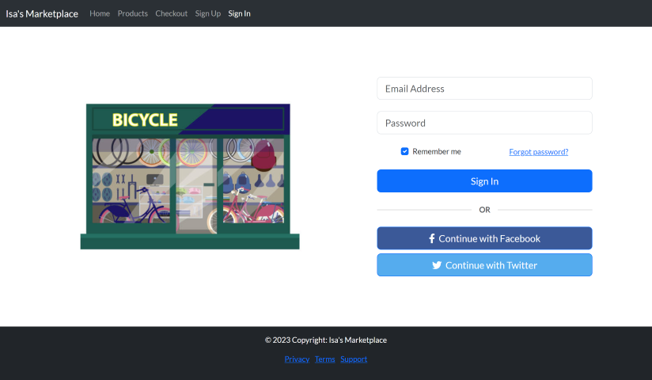

# Isa's Marketplace

The purpose of this project is to provide a platform for customers to browse and purchase bicycle parts online. The website is designed to be user-friendly and easy to navigate. The homepage features text and images moving responsively depending on the window size. The products page displays a list of bicycle parts with images, names, and prices, and includes an add to cart button for each bicycle part. The checkout page includes a shopping cart section with a list of bicycle parts and their prices, and a form for users to enter their shipping and payment information. This project is built using HTML, CSS, Bootstrap, and Javascript.
## Project Layout
### Homepage


### User Registration


### User Login

.png)

### Products Page


### Checkout


## Code Highlight

### Code

In `/pages/checkout.html` line 215:

Instead of:

```html
<select class="form-select" id="state" required>
  <option value="">Choose...</option>
  <option value="AL">Alabama</option>
  <option value="AK">Alaska</option>
  <option value="AZ">Arizona</option>
  <option value="AR">Arkansas</option>
  <option value="CA">California</option>
  <option value="CO">Colorado</option>
  <option value="CT">Connecticut</option>
  <option value="DE">Delaware</option>
  <option value="DC">District Of Columbia</option>
  <option value="FL">Florida</option>
  <option value="GA">Georgia</option>
  <option value="HI">Hawaii</option>
  <option value="ID">Idaho</option>
  <option value="IL">Illinois</option>
  <option value="IN">Indiana</option>
  <option value="IA">Iowa</option>
  <option value="KS">Kansas</option>
  <option value="KY">Kentucky</option>
  <option value="LA">Louisiana</option>
  <option value="ME">Maine</option>
  <option value="MD">Maryland</option>
  <option value="MA">Massachusetts</option>
  <option value="MI">Michigan</option>
  <option value="MN">Minnesota</option>
  <option value="MS">Mississippi</option>
  <option value="MO">Missouri</option>
  <option value="MT">Montana</option>
  <option value="NE">Nebraska</option>
  <option value="NV">Nevada</option>
  <option value="NH">New Hampshire</option>
  <option value="NJ">New Jersey</option>
  <option value="NM">New Mexico</option>
  <option value="NY">New York</option>
  <option value="NC">North Carolina</option>
  <option value="ND">North Dakota</option>
  <option value="OH">Ohio</option>
  <option value="OK">Oklahoma</option>
  <option value="OR">Oregon</option>
  <option value="PA">Pennsylvania</option>
  <option value="RI">Rhode Island</option>
  <option value="SC">South Carolina</option>
  <option value="SD">South Dakota</option>
  <option value="TN">Tennessee</option>
  <option value="TX">Texas</option>
  <option value="UT">Utah</option>
  <option value="VT">Vermont</option>
  <option value="VA">Virginia</option>
  <option value="WA">Washington</option>
  <option value="WV">West Virginia</option>
  <option value="WI">Wisconsin</option>
  <option value="WY">Wyoming</option>
</select>
```

There is:

```html
<select class="form-select" id="state" required>
  <option value="">Choose...</option>
</select>
```
And in `/scripts/checkout.js`:

```javascript
function addToStateSelect() {
  //get select with id state from the DOM
  let stateSelect = document.getElementById('state');

  //get data from JSON file
  fetch('/db/states.json').then((Response) =>
    Response.json().then((data) => {
      // for each state
      for (let i = 0; i < data.length; i++) {
        //add option element to select element
        stateSelect.appendChild(
          makeOptionElement(data[i].name, data[i].abbreviation)
        );
      }
    })
  );
}

function makeOptionElement(name, abbreviation) {
  //create a new element
  let myOptionEl = document.createElement('option');
  //add value attribute equal to abbreviation
  myOptionEl.value = abbreviation;
  //add text into the element
  myOptionEl.text = name;

  return myOptionEl;
}
```
### Step by Step

1. get element from DOM with id `state`
2. get data from `/db/states.json`
3. for every item in states invoke `makeOptionElement(name, abbreviation)`
   1. create element `<option>`
   2. add value attribute with state name ex. `<option value="CA"></option>`
   3. add text into the element ex. `<option value="CA">California</option>`
   4. return element
4. append `<option>` child element to parent `<select class="form-select" id="state" required>`

The same process is done with `<select class="form-select" id="country" required>` in line 208 of `checkout.html`.
## Built With

* [HTML](https://developer.mozilla.org/en-US/docs/Web/HTML)
* [CSS](https://developer.mozilla.org/en-US/docs/Web/CSS)
* [Bootstrap](https://getbootstrap.com/docs/5.3/getting-started/introduction/)
* [Javascript](https://developer.mozilla.org/en-US/docs/Web/JavaScript)

## Deployed Link

* [See Live Site](https://isas-marketplace.vercel.app/)


## Authors

* **Isaac Cortes Hernandez** 

- [Link to Portfolio Site](https://portfolio.isaaccortes.com)
- [Link to Github](https://github.com/icortes)
- [Link to LinkedIn](https://www.linkedin.com/cortes-isaac)

## License

This project is licensed under the MIT License 

## Acknowledgments

* Bootstrap Docs
* Bootstrap Examples for `checkout.html` layout
* [mdn docs](https://developer.mozilla.org/en-US/docs/Web/API/Element) for element